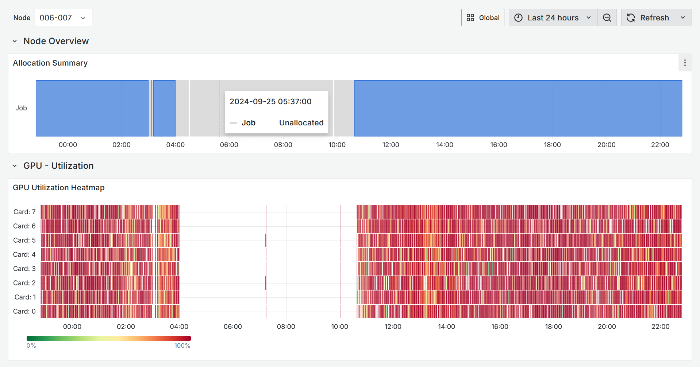

# Grafana Dashboards

```eval_rst
.. toctree::
   :glob:
   :maxdepth: 4
```

Dashboards allow showing real-time cluster telemetry data in a visual form.
Omnistat provides a few sample dashboards for system-wide deployments in
clusters:
- [Standalone Global Dashboard](https://github.com/AMDResearch/omnistat/blob/main/grafana/json-models/standalone-global.json):
  includes an overview of the system, with telemetry for each one of the
  GPUs; works without a resource manager.
- [Standalone Node Dashboard](https://github.com/AMDResearch/omnistat/blob/main/grafana/json-models/standalone-node.json):
  detailed metrics for a single node in the cluster; works without a resource
  manager.
- [Resource Manager Global Dashboard](https://github.com/AMDResearch/omnistat/blob/main/grafana/json-models/rms-global.json):
  provides an overview of the system with a resource manager, includes job
  indices, and cluster-level telemetry.
- [Resource Manager Node Dashboard](https://github.com/AMDResearch/omnistat/blob/main/grafana/json-models/rms-node.json):
  detailed metrics and job allocation for a single node in the cluster.
- [Resource Manager Job Dashboard](https://github.com/AMDResearch/omnistat/blob/main/grafana/json-models/rms-job.json):
  provides detailed time-series data, load distribution, and other metrics for
  a single job in a system with a resource manager.

## Import dashboards

After [installing and configuring Omnistat](installation/system-install),
ensure the Prometheus data source has been added to Grafana, and then import
the sample dashboards.

To add a data source to Grafana:
1. Click **Connections** in the left-side menu.
2. Enter "Prometheus" in the search dialog, and click the **Prometheus** button
   under the search box.
3. Configure the new Prometehus data source following instructions and provide
   the hostname and port where Omnistat's Prometheus server is running.

To import a dashboard:
1. Click **Dashboards** in the left-side menu.
2. Click **New** and select **New Dashboard** from the drop-down menu.
3. On the dashboard, click **+ Add visualization**.
4. Upload the dashboard JSON file.

Sample dashboards are configured using standard default values for settings
such as network ports, but may require changes depending on the environment.
The following variables represent the most relevant dashboard settings:
- `source`: Name of the Prometheus data source where the data is stored.
   Defaults to `prometheus`.
- `omnistat_exporter_port`: Port of the Omnistat monitor. Defaults to `8000`.
- `node_exporter_port`: Port of the Prometheus Node Exporter. Defaults to `9100`.

To configure a dashboard:
1. Open a dashboard in edit mode.
2. Click **Dashboard settings** located at the top of the page.
3. Click **Variables**.
4. Click the desired variable and update its value.

## Example screenshots





