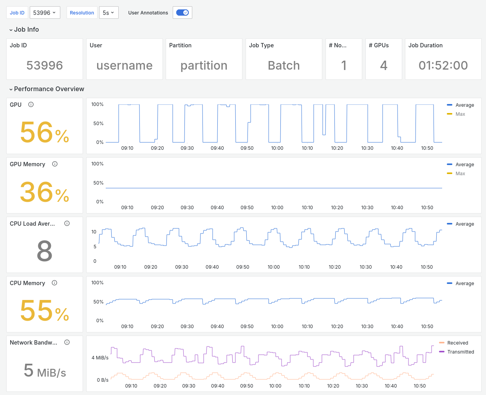

# Grafana Dashboards

```eval_rst
.. toctree::
   :glob:
   :maxdepth: 4
```

Dashboards allow showing real-time cluster telemetry data in a visual form.
Omnistat provides two sample dashboards for system-wide deployments in
clusters with SLURM:
- [Global Dashboard](https://github.com/AMDResearch/omnistat/blob/main/grafana/json-models/slurm-global.json):
  includes an overview of the system, job indices, and cluster-level telemetry.
- [Job Dashboard](https://github.com/AMDResearch/omnistat/blob/main/grafana/json-models/slurm-job.json):
  includes detailed time-series data, load distribution, and other metrics for
  a single job.

## Import dashboards

After [installing and configuring Omnistat](installation/system-install),
ensure the Prometheus data source has been added to Grafana, and then import
the sample dashboards.

To add a data source to Grafana:
1. Click Connections in the left-side menu.
2. Enter "Prometheus" in the search dialog, and click the "Prometheus" button
   under the search box.
3. Configure the new Prometehus data source following instructions and provide
   the hostname and port where Omnistat's Prometheus server is running.

To import a dashboard:
1. Click Dashboards in the left-side menu.
2. Click New and select New Dashboard from the drop-down menu.
3. On the dashboard, click + Add visualization.
4. Upload the dashboard JSON file.

## Example screenshots



