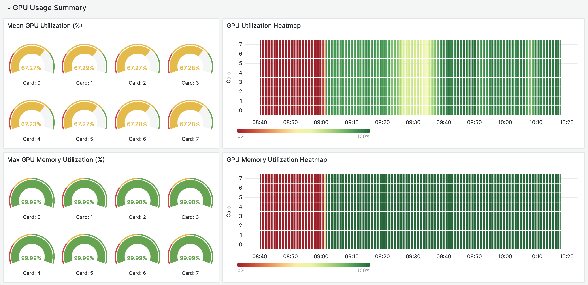

# Omnistat Documentation


```eval_rst
.. toctree::
   :glob:
   :maxdepth: 4
   :caption: Table of Contents
   :hidden:

   introduction
   installation/index
   grafana
```

Welcome to the documentation area for **Omnistat**, a set of Python utilities and data collectors to support scale-out cluster telemetry targeting AMD Instinct (tm) MI accelerators.

[](images/omnistat_intro.png)


 Use the navigation links on the left-hand side of this page to access a more detailed [overview](introduction.md) for the project along with [installation](installation/index.md) details and [visualization](grafana.md)  capabilities.

 [Browse Omnistat source code on Github](https://github.com/AMDResearch/omnistat)